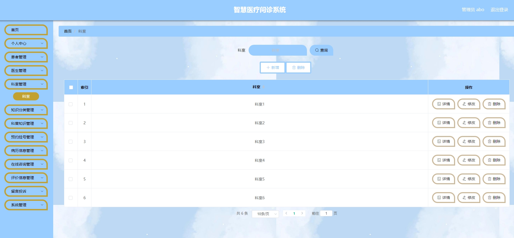

# 1.项目介绍

- 系统角色：管理员、医生、患者
- 功能模块：管理员（患者管理、医生管理、科室管理、知识分类管理、预约挂号、病历信息等）、医生（预约挂号、病历信息、在线咨询）、患者（预约挂号、个人中心、在线咨询、评价、留言）
- 技术栈：SSM、Vue、Layui（门户web）等
- 测试环境：idea2024、navicat、MySQL5.7、Maven3
# 2.项目部署

- 通过Navicat创建数据库，导入sql
- 根据本地数据库环境，修改src/main/resources/config.properties  3-5行（这步很关键）
- 配置tomcat，并启动
- 管理web：http://localhost:8080/ssmmn4m9/admin/dist/index.html（注意这个ssmmn4m9，是我在tomcat配置里设置的，你可以自己修改），账号密码：abo/abo
- 门户web：http://localhost:8080/ssmmn4m9/front/index.html  账号密码自行查询数据库
# 3.项目部分截图

# 4.获取方式
[戳我查看](https://gitee.com/aven999/mall)